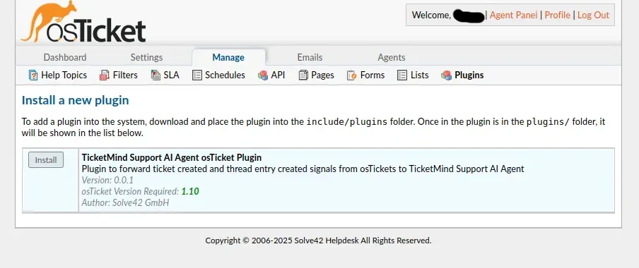
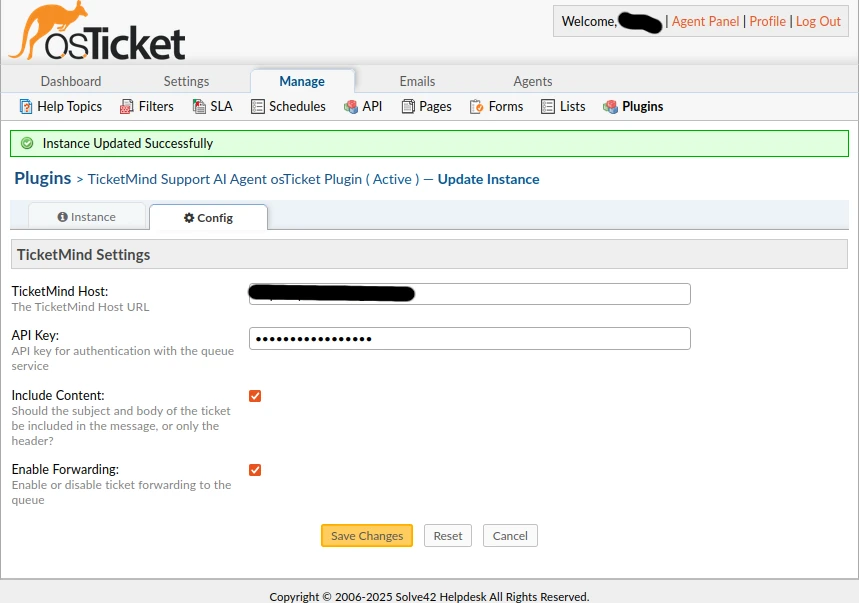

# TicketMind the Support AI Agent

This plugin integrates osTicket with TicketMind's AI-powered support agent platform.

## Overview
The TicketMind Support AI Agent consists of the agent part and receives the tickets from osTicket via this plugin which is provided in this repository. 
The ticketmind-ost-signals plugin forwards ticket creation and thread entry events from osTicket to the TicketMind AI Agend Backend for processing and response creation.

For details see the product page https://ticketmind.de. For technical use case description see companies page https://solve42.de/uc/ticketmind.html#start.
Here we handle only the installation part of the plugin.

## System Requirements

### Prerequisites
- **osTicket**: Version 1.10 or higher
- **PHP**: Version 8.2 or higher
- **PHP Extensions**:
  - `ext-json` (JSON functions)
  - `ext-filter` (Input filtering)
  - `ext-mbstring` (Multibyte string support)
- **Composer**: For installing PHP dependencies

### Network Requirements
In case you have restricted outbound HTTPS connectivity. You will need to open the firewalls. You will be provided with the appropriate TicketMind API endpoints on signing up to the product.
If you dont restrict outbound HTTPS connectivity, no further action is required.

## Installation
First step is the installation of the plugin on osTicket server. 
Here you need access to the server where osTicket is installed, or ask the administrator.

### 1. Download the Plugin
There are two options, either downloading the latest release ZIP archive or cloning the repository.
Go for the first option if you want to use the latest stable version and for the cloning option if you want to get the latest changes.

#### Option A: Download ZIP Archive
1. Download the latest release from the GitHub https://github.com/solve42/ticketmind-ost-signals/releases
2. Extract to your osTicket plugins directory. Usually osTicket is installed under `/var/www/osTicket` directory.

```bash
cd /var/www/osTicket/upload/include/plugins
unzip ticketmind-ost-signals.zip
cd ticketmind-ost-signals
```

#### Option B: Clone from Repository
To fetch the latest state
```bash
cd /var/www/osTicket/upload/include/plugins
git clone https://github.com/solve42/ticketmind-ost-signals.git
cd ticketmind-ost-signals
```

### 2. Install Dependencies

The plugin uses Composer for dependency management. Dependencies are installed in the `lib/` directory instead of the standard `vendor/` directory.

#### 2.1 Install composer & dependencies manually
```bash
# Download Composer if not already installed
curl -sS https://getcomposer.org/installer | php

# a) Install dependencies
php composer.phar install

# b) Or if Composer is globally installed
composer install
```

### 3. Verify Installation
Ensure the following files and directories exist:
- `lib/autoload.php` - Composer autoloader
- `lib/symfony/` - Symfony HttpClient library
- `plugin.php` - Plugin metadata file
- `TicketMindSignalsPlugin.php` - Main plugin class

Now the ticketmind-ost-signals plugin can be installed. Go to the osTicket Admin Panel → Manage → Plugins → Add New
The TicketMind Support AI Agent osTicket Plugin should appear. (see screenshot below)



## Configuration

Continue from the last step of the installation process. See the screenshot above.
Install and enable the plugin. Add a new instance.

Required parameters should be provided by TicketMind:

1. **TicketMind Host URL**
   - Enter the full URL of your TicketMind API endpoint
   - Example: `https://api.ticketmind.com/queue`
   - Must include protocol (https://)

2. **API Key**
   - Enter your TicketMind API authentication key
   - Obtain this from your TicketMind account settings
   - Keep this secure - it authenticates your osTicket instance

3. **Include Content in Forwarded Messages**
   - Enable to include full ticket/thread content, because this is what we need for the agent.

   Disabling will only send only metadata (ticket ID, timestamps, etc.)

4. **Enable Forwarding**
   - Otherwise no data will be sent to TicketMind.

Save the instance. See also the screenshot below.




### 3. Save Configuration

Click **Save Changes** to apply your configuration.

## Troubleshooting

### Plugin Not Visible in Admin Panel
the plugin doesn't appear in the admin panel

1. **Set Correct Permissions**
```bash
# Navigate to plugin directory
cd /var/www/osTicket/upload/include/plugins/ticketmind-ost-signals

# Set appropriate ownership (adjust user/group as needed)
chown -R www-data:www-data .

# Set directory permissions
find . -type d -exec chmod 755 {} \;

# Set file permissions
find . -type f -exec chmod 644 {} \;
```

2. **Clear osTicket Cache**
```bash
# Remove cached plugin registry
rm -f /var/www/osTicket/upload/include/plugins/.registry
```

3. **Refresh Plugin List**
   - Return to Admin Panel → Manage → Plugins
   - The plugin should now appear

### Dependencies Not Loading
```bash
# Regenerate autoloader
cd /var/www/osTicket/upload/include/plugins/ticketmind-ost-signals
php composer.phar dump-autoload
```

### API Connection Failures
- Verify TicketMind Host URL is correct and accessible
- Check API key validity
- Ensure outbound HTTPS is not blocked by firewall
- Check osTicket system Logs for errors.

### No Data Being Forwarded
- Verify "Enable Forwarding" is checked
2-Check osTicket system logs for errors

### Debug Mode

To enable detailed logging:

1. Edit `/var/www/osTicket/upload/include/ost-config.php`
2. Add or modify:
```php
define('LOG_LEVEL', LOG_DEBUG);
```

### Log File Locations

- **osTicket System Logs**: Admin Panel → Dashboard → System Logs
- **Apache Error Log**: `/var/log/apache2/osticket_error.log`
- **PHP Error Log**: Check `phpinfo()` for error_log location
- **Plugin-specific Logs**: Check for "TicketMind Plugin" entries in system logs

## Updating the Plugin

### 1. Backup Current Installation
```bash
cd /var/www/osTicket/upload/include/plugins
cp -r ticketmind-ost-signals ticketmind-ost-signals.backup
```

### 2. Update Files
```bash
cd ticketmind-ost-signals
git pull origin main
# Or extract new version from ZIP
```

### 3. Update Dependencies
```bash
php composer.phar update
```

### 4. Clear Cache
```bash
rm -f /var/www/osTicket/upload/include/plugins/.registry
```

### 5. Verify Configuration
- Check plugin settings remain intact
- Test with a new ticket
- Check audit logs for any errors

## Uninstallation

### 1. Disable Plugin
1. Navigate to **Admin Panel → Manage → Plugins**
2. Click on **TicketMind osTicket Signals**
3. Set status to **Disabled**
4. Click **Save Changes**

### 2. Remove Plugin (Optional)
1. Click **Delete** in the plugin management interface
2. Or manually remove files:
```bash
rm -rf /var/www/osTicket/upload/include/plugins/ticketmind-ost-signals
```

### 3. Clean Database (Optional)
```sql
-- Remove plugin configuration from database
DELETE FROM ost_plugin WHERE id = 'ticketmind:ost:signals';
DELETE FROM ost_config WHERE namespace LIKE 'ticketmind%';
```

## Security Considerations
1. Rotate keys periodically

2. File Permissions
   - Ensure plugin files are not world-writable
   - Protect configuration files containing sensitive data

3. Network Security
   - Whitelist outbound connection to TicketMind API endpoints in firewall rules

## Support

### Getting Help
- **GitHub Issues**: https://github.com/solve42/ticketmind-ost-signals/issues
- **Logs**: Always check system and error logs first


### Reporting Issues
When reporting issues, please include:
- osTicket version
- PHP version
- Plugin version
- Error messages from logs
- Steps to reproduce the issue

## License
This plugin is licensed under GPL-2.0-only. See LICENSE file for details.

<div style="text-align: center">
TicketMind is provided by <a href="https://solve42.de" target="_blank">Solve42 GmbH</a>.
</div>